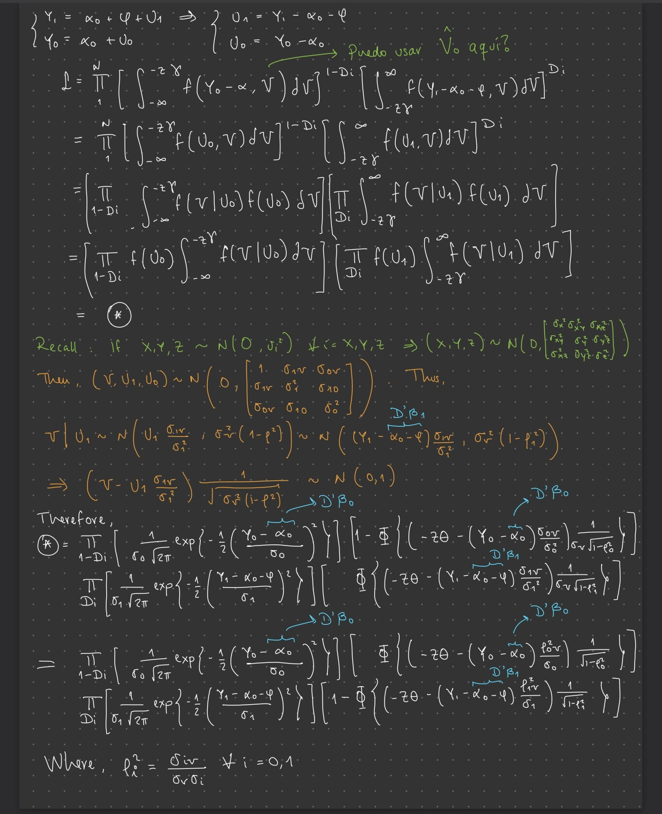

```{r setup, include=FALSE}
library(FactoMineR)
library(factoextra)
library(ggplot2)
library(readr)
library(dplyr)
library(ggthemes)
library(stringr)
library(tidyr)
library(tidyverse)
library(viridis)
library(rmutil)
library(STAR)
library(statmod)
library(invgamma)
library(gtools)
library(mvtnorm)
library(matrixStats)
library(ggpubr)
library(functional)
library(tseries)
library(zoo)
library(forecast)
library(astsa)
library(MLmetrics)
library(tframePlus)
library(bestNormalize)
library(lmtest)
library(knitr)
```

Assume that the economic model generating the data for potential outcomes is of the form:

$$Y_{1} = \alpha_{0} + \varphi + U_{1}$$ $$Y_{0} = \alpha_{0} + U_{0}$$,

where $U_{0}$ and $U_{1}$ represent the unobservables in the potential outcome equations and $\varphi$ represents the benefit associated with the treatment ($D = 1$). Individuals decide whether or not to receive the treatment ($D=1$ or $D=0$) based on a latent variable

$$I := Z_{\gamma} + V $$

where $Z,V$ represent observables and unobservables, respectively. Thus, we can define a binary variable $D$ indicating treatment status,

$$ D= \mathbb{I}\Big[ I \geq 0\Big]$$

Finally, we assume that the error terms in the model are not independent even conditioning\
on the observables, i.e. $U_{1} \not\!\perp\!\!\!\perp U_{0} \not\!\perp\!\!\!\perp V|Z$ ,but $(U\_{0}, U\_{1}, V) \perp\!\!\!\perp Z$.

# 1.

Present expressions for the following treatment parameters: Average Treatment Effect, Treatment on the Treated, Treatment on the Untreated, Marginal Treatment Effect, Instrumental Variables, OLS, and LATE.

## Answer

-   Average Treatment Effect: $$
    ATE = \mathbb{E}[Y_{1}-Y_{0}] = \mathbb{E}[\alpha_{0} + \varphi + U{1}-\alpha_{0} + U_{0}] = \mathbb{E}[\varphi] + \mathbb{E}[U_{1}] + \mathbb{E}[U_{0}]= \varphi$$

-   Treatment on the Treated: $$
    \begin{aligned} 
    TT = &\mathbb{E}[Y_{1}-Y_{0} | D=1 ] \\  = 
    & \mathbb{E}[Y_{1}-Y_{0} | Z \gamma + V \geq 0] \\  = 
    &\mathbb{E}[\varphi + U_{1} -U_{0} | V \geq -Z \gamma] \\  = 
    &\varphi + \mathbb{E}[U_{1}-U_{0} | V \geq -Z \gamma ]  
    \end{aligned}
    $$

-   Treatment on the Untreated: $$
    \begin{aligned}
    TUT= &\mathbb{E}[Y_{1}-Y_{0}| D=0] \\=
    & \mathbb{E}[Y_{1}-Y_{0}| Z\gamma +V<0] \\=
    & \mathbb{E}[\varphi + U_{1} - U_{0}| V< -Z\gamma] \\=
    & \varphi + \mathbb{E}[ U_{1} - U_{0}| V< -Z\gamma]
    \end{aligned}
    $$

-   Local Average treatment Effect: $$
    \begin{aligned}
     LATE=  &\mathbb{E}[Y_{1}-Y_{0}| D(Z)=0, D(Z')=1 ] \\=
     & \mathbb{E}[Y_{1}-Y_{0}| Z\gamma+V \leq 0,~~ Z' \gamma+V \geq 0]\\=
     & \mathbb{E}[\varphi + U_{1} - U_{0}|-Z'\gamma\leq V\leq -Z\gamma] \\=
     & \varphi + \mathbb{E}[ U_{1} - U_{0}|-Z'\gamma\leq V\leq -Z\gamma]
      \end{aligned}
      $$

-   Marginal Treatment Effect: $$
    \begin{aligned}
     MTE(\varphi, -Z'\gamma)=  & \lim_{Z\gamma \rightarrow Z'\gamma} LATE\\=
     & \varphi + \lim_{Z\gamma \rightarrow Z'\gamma}\mathbb{E}[ U_{1} - U_{0}|-Z'\gamma\leq V\leq -Z\gamma]\\=
     & \varphi + \mathbb{E}[ U_{1} - U_{0}|V = Z'\gamma]
      \end{aligned}
      $$

-   Instrumental Variables (IV): $$
     \begin{aligned}
      IV= & \hat{\beta}^{IV}= \frac{Cov(Y,Z)}{Cov(D,Z)}=\frac{\sum (Y-\bar{Y})(Z-\bar{Z})}{\sum(D-\bar{D})(Z-\bar{Z})}
      \end{aligned}
       $$

-   OLS: $$
    \begin{aligned}
        OLS= & \hat{\beta}^{OLS}= \frac{Cov(Y,D)}{Var(D)}=\frac{\sum (Y-\bar{Y})(D-\bar{D})}{\sum(D-\bar{D})(D-\bar{D})}
        \end{aligned}
         $$

# 2.

Suppose now that the error terms in the model have the following structure: $$
\begin{aligned}
& U_{1}=\sigma_{1}\epsilon\\
& U_{0}=\sigma_{0}\epsilon\\
& V=\sigma^{*}_{V}\epsilon\\
& \epsilon \sim N(0,1)
\end{aligned}
$$ Present the closed form expressions for the Treatment on the Treated and the Treatment on the Untreated parameters in this case.

## Answer

As $\epsilon \sim N(0,1)$, we can easily see that the unobservables in the potential outcomes equations are distributed as: $$
\begin{aligned}
& U_{1}=\sigma_{1}\epsilon \sim N(0,\sigma^{2}_{1})\\
& U_{0}=\sigma_{0}\epsilon \sim N(0,\sigma^{2}_{0})\\
& V=\sigma^{*}_{V}\epsilon \sim N(0,\sigma^{*^{2}}_{V})\\
\end{aligned}
$$ Let's analize the following item: $$
\begin{aligned}
\mathbb{E}[~ X~ |~ kX ~\leq~ t ~]= \mu + k\sigma \frac{\phi(t)}{\Phi(t)}
\end{aligned}
$$ Where $X \overset{r.v.}{\sim} N(\mu,\sigma^{2})$, $\Phi$ is the cumulative distribution function and $\phi(·)=\Phi'(·)$ is the probability density function. Now, from the previous question we have that: - Treatment on the Treated: $$
\begin{aligned} 
    TT = 
    & \varphi + \mathbb{E}[U_{1}-U_{0} | V \geq -Z \gamma ]  \\=
    & \varphi + \mathbb{E}[\sigma_{1}\epsilon - \sigma_{0}\epsilon~ | \sigma^{*}_{V}\epsilon \geq -Z \gamma ]  \\=
    & \varphi + (\sigma_{1} - \sigma_{0})\mathbb{E}\Bigg[~\epsilon~| \epsilon \geq \frac{-Z\gamma}{\sigma^{*}_{V}}\Bigg] \\=
    & \varphi + (\sigma_{1} - \sigma_{0})\frac{\phi(-Z\gamma)}{1-\Phi(-Z\gamma)}\\=
    &  \varphi + (\sigma_{1} - \sigma_{0})\frac{\phi(Z\gamma)}{1-\Phi(Z\gamma)}
    \end{aligned}
$$ - Treatment for the Untreated: $$
\begin{aligned} 
    TUT = 
    & \varphi + \mathbb{E}[U_{1}-U_{0} | V \leq -Z \gamma ]  \\=
    & \varphi + \mathbb{E}[\sigma_{1}\epsilon - \sigma_{0}\epsilon~ | \sigma^{*}_{V}\epsilon \leq -Z \gamma ]  \\=
    & \varphi + (\sigma_{1} - \sigma_{0})\mathbb{E}\Bigg[~\epsilon~| \epsilon \leq \frac{-Z\gamma}{\sigma^{*}_{V}}\Bigg] \\=
    & \varphi + (\sigma_{1} - \sigma_{0})\frac{\phi(-Z\gamma)}{\Phi(-Z\gamma)}\\=
    &  \varphi + (\sigma_{1} - \sigma_{0})\frac{\phi(Z\gamma)}{\Phi(Z\gamma)}
    \end{aligned}
$$

# 3.

Now add more structure to the problem. In particular, suppose that $Z = (1,Z_1,Z_2)$ and, correspondingly, $\gamma = (\gamma_0,\gamma_1,\gamma_2)$. Suppose, too, that, $$\begin{aligned}
& \sigma_{1}=0.012, ~~  \sigma_{0}=0.05,~~\sigma^{*}_{V}=1,~~ \alpha_{0}=0.02 , ~~\varphi= 0.2,\\
& \gamma_0=0.2,~~\gamma_1=0.3,~~\gamma_2=0.1\\
& Z_{1}\sim N(-1,9),~~ Z_{2}\sim N(1,9)
\end{aligned}
$$

where $Z_{1} \!\perp\!\!\!\perp Z_{2}$. Since we only observe either $Y_{1}$ or $Y_{0}$ but no both for each individual, the econometrician observes the outcome: $$Y = DY_1 + (1 −D)Y_0$$ Generate a random sample of 5,000 observations. Plot, in a single figure:

-   $Y_{1} −Y_{0}$

-   Average Treatment Effect

-   (Average) Treatment on the Treated

-   (Average) Treatment on the Untreated

-   (Average) Marginal Treatment Effect (for $V = 0$).

## Answer

```{r,results= FALSE}
#Generating 5000 observations random sample
N<- 5000
sigma1<- 0.012^2; sigma0<- 0.05^2; sigmaV<- 1; alpha0<- 0.02; phi<- 0.2
gamma0<- 0.2; gamma1<- 0.3; gamma2<- 0.1


set.seed(180618)
eps<- rnorm(N)
Z1<- rnorm(N,-1,9)
Z2<- rnorm(N,1,9)
U1<- sigma1*eps
U0<- sigma0*eps
V<- rnorm(N,0,sigmaV)

# Generate vector of ones (5000x1)
ones<- rep(1,5000)

# Generate Z=(1,Z1,Z2)
Z<- cbind(ones,Z1,Z2) 

# Generate Gamma Vector-> Gamma=(Gamma0,..,Gamma2)
Gamma <- rbind(gamma0,gamma1,gamma2) 

# Get latent Variable I= Z%*%Gamma + V
I<- (Z%*%Gamma) + V

# Get D= Indicator[I>=0]
D<- ifelse(I>=0, 1, 0)

# Generating Potential Outcomes
Y1<- alpha0 + phi + U1
Y0<- alpha0 + U0

# Generate Y= DY1 + (1-D)Y0
Y<- D*Y1 + (1-D)*Y0

#Let's Begin to Plot
Df<- data.frame('Delta' = Y1 - Y0,
                'Y1' = Y1, 'Y0' = Y0,
                'DecVar' = D, 'Latent' = I, 'UnObs' = V )

(ATE<- Df %>% pull(Delta) %>% mean())
(TT<- Df %>% filter(DecVar == 1) %>% pull(Delta) %>% mean())
(TUT<- Df %>% filter(DecVar == 0) %>% pull(Delta) %>% mean())
(MTE <- Df %>% filter(abs(Latent - V) <= 0.005) %>% pull(Delta) %>%
       mean())

ggplot(Df, aes(x = Delta, y = ..density..)) +
    geom_density(alpha = 0.4, fill = 'azure') +
    geom_vline(xintercept = ATE, linetype = 'dashed', colour = 'dodgerblue') +
    geom_text(aes(x = ATE - 0.0003, y = 90, label = 'ATE'), angle = 90) +
    geom_vline(xintercept = TT,
               linetype = 'dashed',
               colour = 'firebrick1', size= 1.2) +
    geom_text(aes(x = TT - 0.0003, y =70 , label = 'TT'), angle = 90) +
    geom_vline(xintercept = TUT,
               linetype = 'dashed',
               colour = 'blue1') +
    geom_text(aes(x = TUT - 0.0003, y = 50, label = 'TUT'), angle = 90) +
    geom_vline(xintercept = MTE,
               linetype = 'dashed',
               colour = 'chocolate1') +
    geom_text(aes(x = MTE + 0.001, y = 50, label = 'MTE'), angle = 90) +
    labs(
        title = 'Distribution of Gains',
        x = 'Delta',
        y = NULL,
        caption = paste0(
            'ATE = ' ,round(ATE,1),
            
            ', TT = ' ,TT,
        
            ', TUT = ', TUT,
          
            ', MTE (V = 0) = ', MTE
        )
    )+theme_minimal()

```

# 4.

Compute and present the following parameters, in order to compare and comment results:

## Answer

-   LATE($z_1 = −2,z′_1 = 1$) We know that LATE can be expressed as: $$LATE = \varphi + (\sigma_{1} - \sigma_{0})\frac{\phi(z'\gamma)-\phi(z\gamma)}{\Phi(z'\gamma)-\Phi(z\gamma)}$$

```{r}
(LATE.1<- phi + (sigma1 - sigma0)*
  (dnorm(1*Gamma)-dnorm(-2*Gamma)/(pnorm(1*Gamma)-pnorm(-2*Gamma)))%>% mean())
```

-   LATE($z_2 = 0,z′_2 = 2$)

```{r}
(LATE.2<- phi + (sigma1 - sigma0)*
  (dnorm(2*Gamma)-dnorm(0*Gamma)/(pnorm(2*Gamma)-pnorm(00*Gamma)))%>% mean())
```

-   IV ($Z_1$)

```{r}
(BetaZ1.IV<- cov(Z[,2], Y) / cov(Z[,2], D))

```

-   IV ($Z_2$)

```{r}
(BetaZ2.IV<- cov(Z[, 3], Y) / cov(Z[, 3], D))
```

-   OLS

```{r}
(OLS<- cov(Y,D) / var(D))
```

We would need positivity of weight to correctly interpret IV estimates as treatment effects. However, it is interesting to see that none of this estimated parameters diverges far away from each other; that is, values are very similar one another. Now, if we assume that all weights are positive, the IV estimator should not be interpretable as the unconditional LATE parameter, even the conditional one. However, seems that there exists a causal effect on both LATE estimates, as they are focused on compliers (i.e. $D = 1$).

```{r, echo=FALSE}
ggplot(Df, aes(x = Delta, y = ..density..)) +
    geom_density(alpha = 0.4, fill = 'azure') +
    geom_vline(xintercept = LATE.1, linetype = 'dashed', colour = 'dodgerblue')+
    geom_text(aes(x = LATE.1 + 0.0003, y = 90, label = 'LATE 1'), angle = 90) +
    geom_vline(xintercept = LATE.2,
               linetype = 'dashed',
               colour = 'firebrick1', size= 1.2) +
    geom_text(aes(x = LATE.2 - 0.0004, y =70 , label = 'LATE 2'), angle = 90) +
    geom_vline(xintercept = BetaZ1.IV,
               linetype = 'dashed',
               colour = 'blue1') +
    geom_text(aes(x = BetaZ1.IV - 0.0005, y = 90, label = 'Beta IV 1'), 
              angle = 90) +
    geom_vline(xintercept = BetaZ2.IV,
               linetype = 'dashed',
               colour = 'violet') +
    geom_text(aes(x = BetaZ2.IV - 0.0006, y = 40, label = 'Beta IV 2'), 
              angle = 90) +
    geom_vline(xintercept = OLS,
               linetype = 'dashed',
               colour = 'chocolate1') +
    geom_text(aes(x = OLS + 0.001, y = 50, label = 'OLS'), angle = 90) +
    labs(
        title = 'Distribution of Gains',
        x = 'Delta',
        y = NULL,
        caption = paste0(
            'LATE 1 = ' ,round(LATE.1,5),
            
            ', LATE 2 = ' ,round(LATE.2,5),
        
            ', IV 1 = ', round(BetaZ1.IV,5),
          
            ', IV 2 = ', round(BetaZ2.IV,5),
            ', OLS = ', round(OLS,5)
        )
    )+theme_minimal()
```

# 5.

Estimate the model by GMM, using $Z = (Z_1,Z_2)$ as instruments. Use $\hat{V_{0}}=\frac{1}{n}\sum_{i=1}^{n}z'_{i}z_{i}$ to construct the weighting matrix. Present your point estimates and the corresponding standard errors.

## Answer

We know that $\hat{\beta}_{GMM}$ minimizes, taking $Y=y$: $$
\overset{min}{\beta}~~\frac{1}{n}(y-D\beta)'ZV^{-1}_{0}Z'(y-D\beta)
$$

Then, $$
\hat{{\beta}}_{EGMM}= ~~[D'ZV^{-1}_{0}Z'D]^{-1}DZV^{-1}_{0}Z'y
$$

```{r}
Z<- cbind(Z1,Z2)

(V.hat0<- (1/N) * (t(Z)%*%Z))

#Implement EGMM (Efficient GMM)
#### Use solve() to invert matrices

(BetaEGMM<- solve(t(D) %*% Z %*% solve(V.hat0) %*% t(Z) %*% D) %*%
           t(D) %*% Z %*% solve(V.hat0) %*% t(Z) %*% Y %>% as.numeric())

# Point Estimates
Y.EGMM <- alpha0 + (BetaEGMM * D) + U0
Y.IV1<- alpha0 + (as.numeric(BetaZ1.IV) * D) + U0
Y.IV2<- alpha0 + (as.numeric(BetaZ2.IV) * D) + U0
Y.OLS<- alpha0 + (as.numeric(OLS) * D) + U0


# Standard Errors
se.EGMM <- sqrt(mean((Y-Y.EGMM)^2))
se.IV1 <- sqrt(mean((Y-Y.IV1)^2))
se.IV2 <- sqrt(mean((Y-Y.IV2)^2))
se.OLS <- sqrt(mean((Y-Y.OLS)^2))

Df1<- data.frame('Y' = Y,
                'Y.EGMM' = Y.EGMM,
                'Y.IV1' = Y.IV1,
                'Y.IV2' = Y.IV2,
                'Y.OLS' = Y.OLS)

ggplot(Df1) +
    geom_density(aes(x = Y, y = ..density..),alpha = .4, colour = 'dodgerblue')+ 
    geom_density(aes(x = Y.EGMM, y = ..density..),alpha = 0.15, 
                 colour= 'tomato')+
    geom_density(aes(x = Y.IV1, y = ..density..),alpha = 0.15, 
                 colour= 'orchid')+
    geom_density(aes(x = Y.IV2, y = ..density..),alpha = 0.15, 
                 colour= 'gold')+
    geom_density(aes(x = Y.OLS, y = ..density..),alpha = 0.15, 
                 colour= 'grey0')+
    labs(x= 'Estimates', title= 'Estimate Density Comparison')+
    theme_minimal()

```

*We can see that we are not far off the actual model*.

```{r, echo=FALSE}
ggplot(Df, aes(x = Delta, y = ..density..)) +
    geom_density(alpha = 0.4, fill = 'azure') +
    geom_vline(xintercept = BetaEGMM, linetype = 'dashed', 
               colour = 'dodgerblue')+
    geom_text(aes(x = BetaEGMM+ 0.0003, y = 90, label = 'BetaEGMM'), 
              angle = 90) +
    geom_vline(xintercept = ATE,
               linetype = 'dashed',
               colour = 'firebrick1', size= 1.2) +
    geom_text(aes(x = ATE - 0.0004, y =80 , label = 'ATE'), angle = 90) +
    geom_vline(xintercept = OLS,
               linetype = 'dashed',
               colour = 'gray0') +
    geom_text(aes(x = OLS + 0.0005, y = 50, label = 'OLS'), angle = 90) +
    labs(
        title = 'Distribution of Gains',
        x = 'Delta',
        y = NULL,
        caption = paste0(
            'ATEBeta EGMM = ' ,round(BetaEGMM,5),
            ', ATE = ' ,round(ATE,1),
            ', OLS = ', round(OLS,5)
        )
    )+theme_minimal()

```

# 6.

Write down the likelihood function of the model.

```{r, fig.align='center', echo= FALSE}

```

## Answer

# 7.

Discuss which parameters (i.e. coefficients) are and are not identified.

## Answer

We are able to see a many of the parameters we've been working on so far, such as: $Y_{i}, \sigma_{i}, D_{i},Z,\varphi~~\forall ~~i= 0,1$. We added new ones such as $\beta_i, \rho_{i}^2~~\forall ~~i=0,1$. Also, there are covariances we didn't have before that we must treat and calculate carefully in order to estimate the identified parameters using MLE method.

# 8.

Estimate the (identified) parameters of the model by Maximum Likelihood. Present your point estimates and the corresponding standard errors.

## Answer

```{r}
# Identified
(rho_0V<- cov(U0,V)/(sd(U0)*sd(V)))
(rho_1V<- cov(U1,V)/(sd(U1)*sd(V)))
# We know that OLS estimators are BLUEs (Best Linear Unbiased Estimators)
(BetaMLE<- solve(t(D) %*% D) %*% t(D) %*% Y %>% as.numeric())

# Point Estimations
Y.MLE<- alpha0 + (BetaMLE * D) + U0
  
  
# Standard Errors
(se.MLE<- sqrt(mean((Y-Y.MLE)^2)))
  
```
